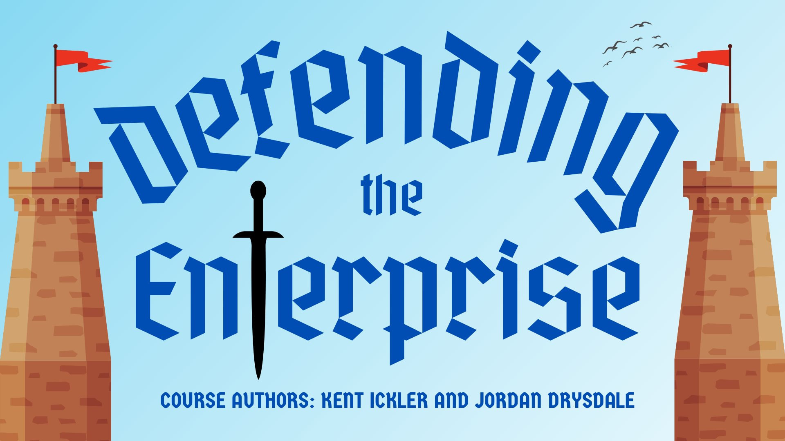

# Defending the Enterprise 

---

<!-- Start Document Outline -->

* [Course Instructors](#course-instructors)
	* [Kent Ickler](#kent-ickler)
		* [Contact](#contact)
		* [Background](#background)
	* [Jordan Drysdale](#jordan-drysdale)
		* [Contact](#contact-1)

<!-- End Document Outline -->

---

# Course Instructors

## Kent Ickler

Kent Ickler started his Information Technology career working for an Internet Service Provider supporting the MidWest’s broadband initiatives of the early 2000s. His interest in technology and business operations drove his career to working for multiple Fortune 500 companies and equipping their organizational leadership with business analytical data that would support their technology initiatives. With his continued interest in Business Operations, Kent completed his postgraduate education in Business Management. With an understanding of Information Technology, System Administration, Accounting, and Business Law, Kent has helped businesses leverage technology for competitive advantage while balancing the risks associated with today’s dynamic network environments.  Kent has been with Black Hills Information Security for three years in security and administration roles.

### Contact
* Github: Relkci
* Twitter: Krelkci
* Discord: Reclki
* LinkedIn: https://www.linkedin.com/in/kentickler/
* Email: kent@defensiveorigins.com

### Background

* Certifications: GYPC, GCIH, MCSA, MCSE, MCTS, Sec+, A+, Prj+, Net+, CIW Pro, CIEW Web, CIW-DB, CIW-JS, CIW-Associate
* Education: Masters Management, BS-IT Network Design and Management
* Memberships: IEEE, ISACA, CIS Workbench
 ---
 
## Jordan Drysdale

Jordan was around for the inception of Napster and the explosion of P2P networks. This drove his fascination with network systems and led him toward a career in IT. Jordan’s first gig in the industry included supporting Latin American networking customers for Hewlett Packard’s network support division. After five years of support, engineering, training, and stress, Jordan became a wireless escalations team lead and multi-vendor certified problem solver. With kids in tow, Jordan headed back toward the Dakotas to be nearer extended family and friends where he learned Citrix, VMware, VDI, supported Cisco gear, implemented profile management solutions, deployed remote networks at scale, and ensured performance across infrastructure. Before becoming a penetration tester, Jordan supported multiple (50+) domains as part of an MSSP’s rock star team. Solutions included HP Networking, FortiGate/FortiManager/FortiWeb/FortiAnalyzer et al., Cisco ASA, HP DL/GL/ML, Dell, VMware, NetApp, and the list goes on. Since 2015, Jordan has been a penetration tester with the Black Hills InfoSec team.

### Contact

* GitHub: rev10d
* Twitter: rev10d
* Discord: rev10d
* LinkedIn: https://www.linkedin.com/in/jordandrysdale/
* Email: jordan@defensiveorigins.com

